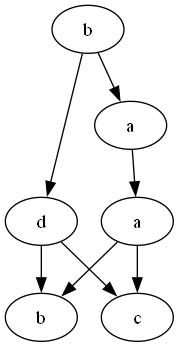
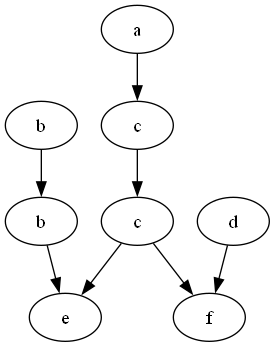

# Zadanie domowe - programowanie współbieżne

## Spis treści
1. [Importy](#Importy)
2. [Pobieranie danych](#pobieranie-danych)
3. [Wyznaczanie relacji D oraz I](#wyznaczanie-relacji-d-oraz-i)
4. [Wyznaczanie postaci normalnej Foaty](#wyznaczanie-postaci-normalnej-foaty)
5. [Rysowanie grafu zależnosći dla słowa w](#rysowanie-grafu-zależności-dla-słowa-w)
6. [Przykłady](#przykłady)
---

## Importy
```python
import re,os 
from typing import List
from collections import deque
import graphviz
```

---


## Pobieranie danych

Pobieramy akcje, słowo i transakcje z plików tekstowych

```python
def read_data_from_files(example_folder: str):
    actions_file = os.path.join("examples",example_folder,"actions.txt")
    word_file = os.path.join("examples",example_folder,"word.txt")
    transactions_file = os.path.join("examples",example_folder,"transactions.txt")
    
    with open(actions_file, "r") as f:
        actions_str = f.read().strip()
        A = re.findall(r'\b\w\b', actions_str)

    with open(word_file, 'r') as f:
        w = f.read().strip()

    transactions = {}
    with open(transactions_file, "r", encoding="utf-8") as f:
        for line in f:
            match = re.match(r'\((\w)\)\s+(.+)', line.strip())
            if match:
                action = match.group(1)
                dep = match.group(2).replace(":=", "<-")
                transactions[action] = dep
    
    return A,w,transactions

```

---


## Wyznaczanie relacji D oraz I

Tworzymy relacje D oraz I na podstawie zależności między akcjami

```python
#zamiana zapisu transakcji na wygodniejsze do obsługi
def parse_transactions(A: List,transactions: dict) -> dict:
    new_transactions = {}
    for action in A:
        #pobieramy daną transakcje
        dep = transactions.pop(action)
        #dzielimy na elementy po lewej i prawej stronie znaku <-
        left,right = dep.split(" <- ")
        #uzywamy wyrazen regularnych do wybrania zmiennych ze wzoru
        variables = re.findall(r'[a-zA-Z]+', right)
        #dodajemy do slownika przerobione dane
        new_transactions.update({action :(left,variables)})

    return new_transactions

#sprawdzamy czy akcje są zależne
def actions_dependent(dep1: tuple,dep2: tuple) -> bool:
    left1, right1, left2, right2 = dep1[0], dep1[1], dep2[0], dep2[1]
    return left1 == left2 or left1 in right2 or left2 in right1

#stworzenie relacji D oraz I
def create_D_and_I(A : List,transactions: dict) -> tuple[List,List]:
    transactions = parse_transactions(A,transactions)
    D = []
    I = []

    #kazda akcje porownujemy z kazda sprawdzajac czy są niezalezne 
    # i w zaleznosci od wyniku dodajemy odpowiednio do I lub D
    for action1, dep1 in transactions.items():
        for action2, dep2 in transactions.items():
            if actions_dependent(dep1,dep2):
                D.append((action1,action2))
            else:
                I.append((action1,action2))

    return D,I
```


---

## Wyznaczanie postaci normalnej Foaty

Używamy stosów do wyznaczenia postaci normalnej Foaty - algorytm ze strony 10

```python
#sprawdzenie czy wszystkie stosy sa puste
def all_stacks_empty(stacks: dict) -> bool:
    for letter,stack in stacks.items():
        if stack: return False
    return True

def compute_FNF(A : List,w : str ,transactions: dict, D : List, I : List) -> List[List[chr]]:
    special_sign = '|'
    stacks = {}
    fnf = []

    #korzystamy z algorytmu wyznaczania fnf ze strony 10 - uzycie stosow
    #tworzymy slownik stosow 
    for letter in A:
        stacks.update({letter : []})

    #idziemy od konca slowa po kazdej literze 'x'
    #dla kazdej litery 'x' dodajemy ja do odpowiedniego stosu i jednoczesnie dodajemy znak specjalny
    #w kazdym innym stosie ktorego litera 'y' jest zalezna od naszej litery: (x,y) is in D
    for i in range(len(w)-1,-1,-1):
        letter = w[i]
        stack = stacks.get(letter)
        stack.append(letter)

        #nie dodajemy znaku specjalnego do stosu w ktorym litera 'x' i 'y' to ta sama litera
        for letter1,stack1 in stacks.items():
            if (letter,letter1) not in I and (letter1,letter) not in I and letter1 != letter:
                stack1.append(special_sign)

    #dokpoki wszystkie stosy nie sa puste
    while not all_stacks_empty(stacks):

        #pobieramy wartosci z gory kazdego stosu
        top_layer = []
        for letter,stack in stacks.items():
            if stack: top_layer.append(stack[-1])

        #sortujemy leksykograficznie pobrane elementy
        top_layer.sort()
        fnf_layer = []
        #tworzymy "warstwe" fnf z gornych elementow ktore nie są znakiem specjalnym 
        for char in top_layer:
            if char == special_sign:
                break   
            fnf_layer.append(char)

        #jesli warstwa nie jest pusta (czyli nie sklada sie z samych znakow spejalnych) to dodajemy ja do naszego fnf wynikowego
        if fnf_layer: fnf.append(fnf_layer)

        #usuniecie niektorych znakow specjalnych 
        #letter - litera stosu
        #stack - stos
        for letter,stack in stacks.items():
            #jesli stos jest pusty idziemy dalej
            if not stack: continue

            #jesli w warstwie fnf nic nie ma to usuwamy znak specjalny
            #bo to znaczy ze dana warstwa fnf to same znaki specjalne 
            # wiec je usuwamy zeby przejsc dalej 
            if not fnf_layer:
                stack.pop()
            
            #jesli litera stosu to jedna z liter warstwy fnf to ja zdejmujemy
            elif letter in fnf_layer:
                stack.pop()
            
            #jesli litera stosu nie jest w warstwie fnf to robimy zdejmowanie odpowiednich znakow specjalnych na stosach
            #jesli litera stosu jest niezalezna od ktorejs z liter z warstwy fnf czyli 
            #dla przynajmniej jednego f: (l,f) nalezy do I to nie zdejmujemy znaku
            else:
        
                is_independent = False

                #dla kazdej litery w warstwie fnf 
                for letter_f in fnf_layer:
                    #jesli (l,f) nalezy do I
                    if (letter,letter_f) in I or (letter_f,letter) in I:
                        is_independent = True

                if not is_independent: stack.pop()

    return fnf

```
---

## Rysowanie grafu zależnosći dla słowa w

Dla kazdego wierzcholka patrzymy na wszystkie wierzcholki z poprzednich warstw FNF, sprawdzamy: 
Czy są zależne: 
 - Jeśli tak to:
    - Jeśli nie istnieje jeszcze scieżka między wierzchołkami to dodajemy krawędź
    - Jeśli istnieje to nie dodajemy krawędzi
 - Jeśli nie to: nie dodajemy krawędzi

```python
#sprawdzenie czy akcje w wierzcholkach sa zalezne
def are_vertices_dependants(I: List[tuple],u,v):
    if (u[1],v[1]) not in I and (v[1],u[1]) not in I:
        return True

#sprawdzenie czy istnieje juz sciezka pomiedzy wierzcholkami
# zwykly BFS
def path_exists(G,s,d):
    visited = set()
    queue = deque([s[0]])

    while queue:
        curr = queue.popleft()
        if curr == d[0]:
            return True
        
        if curr not in visited:
            visited.add(curr)
            for neigh in G[curr]:
                if neigh not in visited:
                    queue.append(neigh)

    return False

#stworzenie grafu dickerta
def create_dickert_graph(I: List[tuple],fnf: List[List[chr]]):
    #tworzymy liste wszystkich wierzcholkow  
    vertices = []
    i = 0
    j = 0
    for fnf_layer in fnf:
        vertices.append([])
        for x in fnf_layer:
            vertices[i].append((j,x))
            j += 1
        i += 1    

    G = [[] for _ in range(j)]

    #dla kazdej warstwy w fnf zaczynajac od 2
    for i in range(1,len(vertices)):
        curr_layer = vertices[i]
        #przechodzimy po poprzednich warstwach
        for j in range(i-1,-1,-1):
            prev_layer = vertices[j]
            #dla kazdego wierzcholka w aktualnej  warstwie
            for u in curr_layer:
                #bierzemy wierzcholek z poprzedniej warstwy
                for k in range(len(prev_layer)-1,-1,-1):
                    v = prev_layer[k]
                    #sprawdzamy czy akcje w wierzcholkach sa zalezne
                    if are_vertices_dependants(I,u,v):
                        #jesli tak to:
                        #sprawdzamy czy istnieje juz sciezka z v do u
                        if not path_exists(G,v,u):
                            #jesli nie to dodajemy krawedz pomiedzy v i u
                            G[v[0]].append(u[0])
                        #jesli sciezka juz istnieje nie robimy nic 

    return G,vertices

#rysowanie grafu z uzyciem biblioteki graphviz
def draw_graph(G: List[List[int]], vertices: List[List[tuple]], example: str):
    dot = graphviz.Digraph(format="png")
    edges = []

    for i, neighbors in enumerate(G):
        for v in neighbors:
            edges.append((i, v))
    
    labels = {x[0]: x[1] for layer in vertices for x in layer}

    for node, label in labels.items():
        dot.node(str(node), label)

    for u, v in edges:
        dot.edge(str(u), str(v))

    dot.render(os.path.join("examples",example,"graph"), view=True)
```
---

## Przykłady
```python
examples = ["ex1","ex2","ex3"]
for example in examples:
    A,w,transactions = read_data_from_files(example)
    D,I = create_D_and_I(A,transactions)
    fnf = compute_FNF(A,w,transactions,D,I)
    G,vertices = create_dickert_graph(I,fnf)
    draw_graph(G,vertices,example)
```
#### Example 1

>**Dane wejściowe:** A = {a,b,c,d},  w = baadbc,
>Transactions:
(a) x := x+y
(b) y := y+2z
(c) x := 3x+z
(d) z := y−z

```txt
Dane wynikowe:

D: [('a', 'a'), ('a', 'b'), ('a', 'c'), ('b', 'a'), ('b', 'b'), 
('b', 'd'), ('c', 'a'), ('c', 'c'), ('c', 'd'), ('d', 'b'),
('d', 'c'), ('d', 'd')]

I: [('a', 'd'), ('b', 'c'), ('c', 'b'), ('d', 'a')]

FNF: (b)(ad)(a)(bc)
```



### Example 2

> **Dane wejściowe:** 
>A = {a,b,c,d,e,f}, w = acdcfbbe,
>Transactions:
(a) x := x+1
(b) y := y+2z
(c) x := 3x+z
(d) w := w+v
(e) z := y−z
(f) v := x+v


```txt
Dane wynikowe:

D: [('a', 'a'), ('a', 'c'), ('a', 'f'), ('b', 'b'), 
('b', 'e'), ('c', 'a'),('c', 'c'), ('c', 'e'), ('c', 'f'), 
('d', 'd'), ('d', 'f'), ('e', 'b'), ('e', 'c'), ('e', 'e'), 
('f', 'a'), ('f', 'c'), ('f', 'd'), ('f', 'f')]


I: [('a', 'b'), ('a', 'd'), ('a', 'e'), ('b', 'a'), 
('b', 'c'), ('b', 'd'), ('b', 'f'), ('c', 'b'), 
('c', 'd'), ('d', 'a'), ('d', 'b'), ('d', 'c'), 
('d', 'e'), ('e', 'a'), ('e', 'd'), ('e', 'f'), ('f', 'b'), ('f', 'e')]


FNF: (abd)(bc)(c)(ef)

```




### Example 3

>**Dane wejściowe:** A = {a,b,c,d,e,f,g},  w = acbfdgcde,
>Transactions:
(a) x := w+y+z
(b) w := x+y
(c) x := x+v+z
(d) z := x+y+w
(e) v := m+x+y
(f) m := m+y
(g) y := z+y+v


```txt
Dane wynikowe:

D: [('a', 'a'), ('a', 'b'), ('a', 'c'), ('a', 'd'), ('a', 'e'), 
('a', 'g'), ('b', 'a'), ('b', 'b'), ('b', 'c'), ('b', 'd'), 
('b', 'g'), ('c', 'a'), ('c', 'b'), ('c', 'c'), ('c', 'd'), 
('c', 'e'), ('d', 'a'), ('d', 'b'), ('d', 'c'), ('d', 'd'), 
('d', 'g'), ('e', 'a'), ('e', 'c'), ('e', 'e'), ('e', 'f'), 
('e', 'g'), ('f', 'e'), ('f', 'f'), ('f', 'g'), ('g', 'a'), 
('g', 'b'), ('g', 'd'), ('g', 'e'), ('g', 'f'), ('g', 'g')]


I: [('a', 'f'), ('b', 'e'), ('b', 'f'), ('c', 'f'), ('c', 'g'), 
('d', 'e'), ('d', 'f'), ('e', 'b'), ('e', 'd'), ('f', 'a'), 
('f', 'b'), ('f', 'c'), ('f', 'd'), ('g', 'c')]


FNF: (af)(c)(b)(d)(cg)(de)
```


### Example 4

>**Dane wejściowe:** A = {a,b,c,d,e,f},  w = afaeffbcd,
>Transactions:
(a) x := x+y
(b) y := z-v
(c) z := v*x
(d) v := x+2y
(e) x := 3y+2x
(f) v := v-2z


```txt
Dane wynikowe:

D: [('a', 'a'), ('a', 'b'), ('a', 'c'), ('a', 'd'), ('a', 'e'), ('b', 'a'), ('b', 'b'), ('b', 'c'), ('b', 'd'), ('b', 'e'), ('b', 'f'), ('c', 'a'), ('c', 'b'), ('c', 'c'), ('c', 'd'), ('c', 'e'), ('c', 'f'), ('d', 'a'), ('d', 'b'), ('d', 'c'), ('d', 'd'), ('d', 'e'), ('d', 'f'), ('e', 'a'), ('e', 'b'), ('e', 'c'), ('e', 'd'), ('e', 'e'), ('f', 'b'), ('f', 'c'), ('f', 'd'), ('f', 'f')]


I: [('a', 'f'), ('e', 'f'), ('f', 'a'), ('f', 'e')]


FNF: (af)(af)(ef)(b)(c)(d)
```


